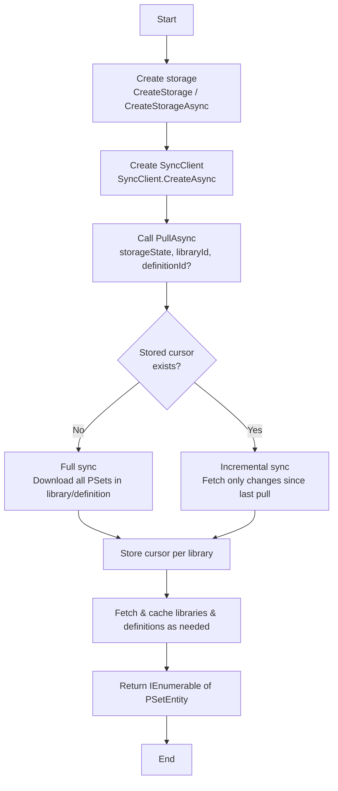
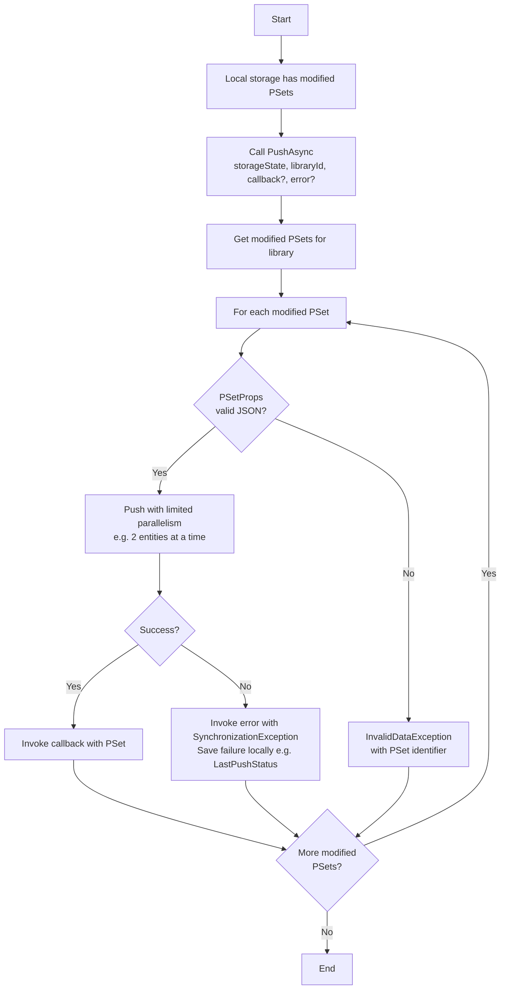

# PSet Synchronization – Developer Guide

A quick, practical reference for public integrators using PullAsync, PushAsync, and related APIs to synchronize PSets with Trimble Connect.

## 1. Public API overview

You'll mainly work with three methods:

**PullAsync**  
Pulls PSet entities from the server into local storage. Handles full vs incremental sync and pagination internally.

**PushAsync (library level)**  
Pushes all locally modified PSets in a library to the server. Supports per-entity success and error callbacks.

**PushOneAsync**  
Pushes a single PSet using an explicit create, update, or delete command.

## 2. Prerequisites

Before syncing PSets, make sure the following are in place:

**Storage**  
The storageState must be a Storage instance created using SyncClient.CreateStorage or CreateStorageAsync. Passing any other IStorageState implementation will result in an ArgumentException.

**SyncClient**  
Create it using SyncClient.CreateAsync(client, storage, cancellationToken). The storage must already contain project state.

**Library ID**  
Required for both pull and push operations. A null or empty libraryId will throw an ArgumentNullException.

## 3. PullAsync – Pull PSets from the server

```csharp
Task<IEnumerable<PSetEntity>> PullAsync(
    IStorageState storageState,
    string libraryId,
    string definitionId = null,
    long? pageSize = null,
    IProgress<SyncProgressEventArgs<PSet>> progress = null,
    CancellationToken cancellationToken = default);
```

**How it behaves:**

- **First run** – If there is no stored cursor, a full snapshot is pulled. All PSets in the library (or definition) are downloaded.
- **Subsequent runs** – Incremental sync. Only changes since the last pull are fetched. The cursor is stored per library in the storage directory.
- **definitionId** – If null, PSets from all definitions in the library are pulled. If provided, only PSets for that specific definition are pulled.
- **pageSize** – Optional. Defaults to 500. Controls how many items are fetched per server page.
- **progress** – Optional. Reported per page with counts for added, updated, deleted, ignored, and total processed.

**Return value:**  
All PSet entities processed during this pull (added, updated, or deleted). Referenced libraries and definitions are fetched and cached automatically when needed.

## 4. PushAsync – Push all modified PSets in a library

```csharp
Task PushAsync(
    IStorageState storageState,
    string libraryId,
    Action<PSetEntity> callback = null,
    Action<SynchronizationException> error = null,
    CancellationToken cancellationToken = default);
```

**How it behaves:**

- Only PSets marked as modified in local storage are pushed.
- Each PSet's PSetProps is validated as JSON before pushing. Invalid JSON causes an InvalidDataException that includes the PSet identifier.
- Push runs with limited parallelism (for example, two entities at a time).
- If one entity fails, the others continue. Failures are saved locally (for example, LastPushStatus or SyncError).

**Callbacks:**

- **callback** – Called after a PSet is successfully pushed.
- **error** – Called when a PSet fails to push. Receives a SynchronizationException that includes entity details and the underlying error.

## 5. PushOneAsync – Push a single PSet

```csharp
Task<PSet> PushOneAsync(
    IStorageState storageState,
    SyncCommand<PSet> syncCommand,
    CancellationToken cancellationToken = default);
```

Use this when you want to explicitly create, update, or delete a single PSet.

**SyncCommand&lt;PSet&gt; contains:**

- **Entity** – The PSet you want to sync.
- **RemoteOperation** – Create, Update, or Delete.
- **AfterPush (optional)** – A callback invoked after a successful push. Useful for updating local state with the server response.

**Return value:**  
The PSet returned by the server, depending on the operation.

**Restrictions:**

- Only PSet entities are supported.
- Passing a PSetLibrary or PSetDefinition will throw a NotSupportedException.

## 6. Key types and namespaces

| Type | Namespace | Description |
|------|-----------|-------------|
| **SyncClient** | Trimble.Connect.Data.Sync | Entry point for all pull and push operations. |
| **Storage** | Trimble.Connect.Data.Sync | Concrete storage implementation required for PSet synchronization. |
| **PSet** and **PSetEntity** | Trimble.Connect.Data.Models | PSet is the main model. PSetEntity is the base type. |
| **SyncProgressEventArgs&lt;PSet&gt;** | Trimble.Connect.Data.Models | Provides progress details such as Added, Updated, Deleted, Ignored, Count, TotalCount, and PercentageComplete. |
| **SyncCommand&lt;PSet&gt;** | Trimble.Connect.Data | Used with PushOneAsync to specify entity and operation. |
| **RemoteOperation** | Trimble.Connect.Data | Values: Create, Update, Delete. |
| **SynchronizationException** | Trimble.Connect.Data | Represents a per-entity push failure. |

## 7. Typical sync flow

1. **Create storage** – Use CreateStorage or CreateStorageAsync.
2. **Create SyncClient** – Call SyncClient.CreateAsync(client, storage).
3. **Pull PSets** – Use PullAsync. First run performs a full sync; later runs are incremental.
4. **Modify locally** – Update PSets via repository or model APIs.
5. **Push changes** – Use PushAsync to push all modified PSets in a library.
6. **Push a single entity (optional)** – Use PushOneAsync when you need explicit control.

## 8. Error handling summary

| Exception | When |
|-----------|------|
| **ArgumentNullException** | storageState or libraryId is null or empty. |
| **ArgumentException** | storageState is not a Storage instance. |
| **InvalidDataException** | PSetProps contains invalid JSON during push. |
| **NotSupportedException** | Attempt to push PSetLibrary or PSetDefinition. |
| **SynchronizationException** | A single entity failed to push. Handle this via the error callback in PushAsync. |

## 9. Best practices for integrators

- Always use Storage created by CreateStorage or CreateStorageAsync.
- Pull before pushing to keep local state and cursors up to date.
- Use progress reporting for large pulls to improve user experience.
- Handle SynchronizationException via the error callback instead of failing the entire push.
- Validate PSetProps JSON before saving locally.
- Scope operations by library (and definition when possible).
- Use PushOneAsync for explicit single-entity create, update, or delete flows.

## 10. NuGet packages

To work with PSet synchronization, install the following packages. If you install the Sync package, the others are pulled in automatically, but you may still reference them directly in your project.

| Package | Purpose | NuGet |
|--------|---------|-------|
| **Trimble.Connect.Data.Sync** | Sync client used for PullAsync and PushAsync | https://www.nuget.org/packages/Trimble.Connect.Data.Sync |
| **Trimble.Connect.Data** | Local storage, Storage, PSet models, SyncCommand | https://www.nuget.org/packages/Trimble.Connect.Data |
| **Trimble.Connect.Client** | Trimble Connect API client, required for SyncClient.CreateAsync | https://www.nuget.org/packages/Trimble.Connect.Client |
| **Trimble.Connect.PSet.Client** | PSet APIs for libraries, definitions, and PSets | https://www.nuget.org/packages/Trimble.Connect.PSet.Client |

## 11. Planned sample update (project vs outside PSet storage)

The PSetSample will be extended to support switching between two storage modes:

**Project PSet storage**  
PSets are tied to a Trimble Connect project. This is the current behavior and uses project storage with PSetProjectStorage.

**Outside PSet storage**  
PSets are stored externally (for example, in a separate database or custom path) and are not bound to a single project.

When this update is available, this guide will include:

- How to switch storage modes in the sample
- Any API or configuration differences
- Notes in the sync flow and best practices sections

## 12. Pull and Push flow (workflow)

### Pull flow



### Push flow


